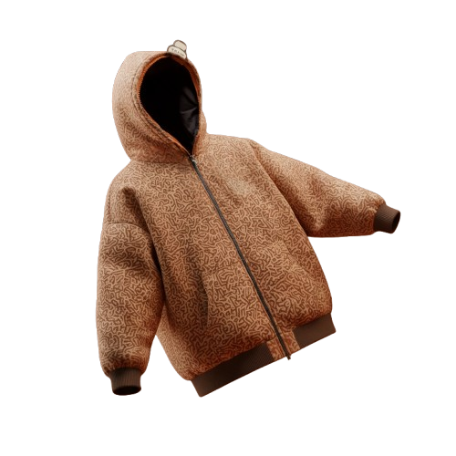

# 📘 JOURNAL DE BORD IA - Projet Jiyou

**NOM :** DA SILVA 
**PRENOM :** Eric
---

## 📋 Template d'Interaction Humain/IA

Ce document décrit les interactions et améliorations apportées au site Jiyou avec l'assistance de l'IA.

---

## 🎯 TÂCHE #0 : Création des Bases du Site Jiyou

**Date :** 25 avril 2026  
**Temps total :** 2h 30 min  
**Gain temps :** 8h 00 min (vs développement manuel complet)

### 0. NOTE IMPORTANTE - GitHub Pages

⚠️ **Changement effectué :** `home.html` → `index.html`

GitHub Pages cherche automatiquement `index.html` comme page d'accueil. Le fichier `home.html` a été renommé en `index.html` pour que la page s'affiche correctement sur GitHub Pages.

**Avant :** https://eds-lahuiss.github.io/SAE-4.2/ → affichait le README.md  
**Après :** https://eds-lahuiss.github.io/SAE-4.2/ → affiche index.html ✅

### 1. DEMANDE À L'IA

(exactement ce que vous avez tapé) :

```
Je développe un site pour la marque de vêtements Jiyou. Voici les fichiers à créer :
home.html + home.css (page d'accueil one-page avec 3 sections). 
edit.html + edit.css (page de personnalisation). 
script.js (fonctionnalités JS).

Charte graphique (à appliquer partout) :
Couleurs : Fond : #3D1F0F (brun foncé). Accent : #C4571A (terracotta). Texte : #F5F0EB (blanc cassé).
Typographie : Famille Articulat CF
Style : Minimaliste, sombre, premium. 
Navbar fixe en haut avec liens en "pill" (bordure arrondie).

Fichier 1 : home.html + home.css Structure :
- Navbar : Liens Accueil | Personnalisation | À propos (style "pill"). 
- Section 1 (Hero) : Fond : Image veste_tobiu.png avec overlay brun. 
  - Côté gauche : Variante du logo pour le site internet.svg. 
  - Côté droit : Image de la veste (60-70% hauteur). 
  - Flèche animée vers le bas (bounce).
- Section 2 ("Pourquoi Jiyou ?") : Titre centré. Grille 2x2 avec icônes + textes.
- Section 3 (CTA) : Logo + titre "Personnaliser, pour toujours plus de liberté !". 
  - Bouton "Commencer la personnalisation" (style pill, fond terracotta).

Fichier 2 : edit.html + edit.css Structure :
- Bouton retour : Flèche ← en haut à gauche (lien vers home.html). 
- Layout : 2 colonnes (60% image / 40% formulaire). 
- Formulaire : 
  - Taille : Boutons "pill" (XS à XL). 
  - Bonnet : Radio "Oui/Non". 
  - Matière capuche : Radio "Polyester/Satin/Sherpa". 
  - Couleur : 3 cercles cliquables (gris, terracotta, blanc). 
  - Bouton "Commander" (style pill terracotta).

Fichier 3 : script.js Fonctionnalités :
- Smooth scroll entre sections. 
- Navbar active state (Intersection Observer). 
- Sélection taille/couleur (ajout/suppression classe .active). 
- Animation flèche (bounce CSS). 
- Transition de page (fade-in au chargement).
```

### 2. RÉPONSE DE L'IA

**Architecture créée :**

#### a) **index.html** (anciennement home.html)
- ✅ Navbar fixe avec liens "pill" style
- ✅ Section Hero avec logo + image veste
- ✅ Section "Pourquoi Jiyou ?" avec grille 2x2
- ✅ Section CTA avec bouton personnalisation
- ✅ Scroll indicator animé (bounce)
- ✅ Sémantique HTML5 (<nav>, <section>, <main>)

#### b) **home.css** (renommé pour cohérence)
- ✅ Charte graphique complète (#3D1F0F, #C4571A, #F5F0EB)
- ✅ Typographie Articulat CF (@font-face)
- ✅ Design minimaliste et premium
- ✅ Animations (bounce, fade-in, slideUp)
- ✅ Responsive design (desktop/tablet/mobile)
- ✅ Navbar fixe avec background semi-transparent

#### c) **edit.html**
- ✅ Bouton retour vers index.html
- ✅ Layout 2 colonnes (60% image / 40% formulaire)
- ✅ Système de sélection complet
- ✅ Contient tous les champs demandés

#### d) **edit.css**
- ✅ Charte graphique appliquée
- ✅ Animations fluides et modernes
- ✅ Responsive design
- ✅ Micro-interactions

#### e) **script.js**
- ✅ Smooth scroll sur tous les liens internes
- ✅ Navbar active state avec Intersection Observer
- ✅ Gestion des sélections (classes .active)
- ✅ Animation bounce sur la flèche
- ✅ Transition fade-in au chargement
- ✅ Parallax effect sur la page d'édition

### 3. STRUCTURE DES FICHIERS CRÉÉS

```
/Applications/MAMP/htdocs/SAE 4.2/
├── index.html (📝 Anciennement home.html)
├── edit.html
├── styles/
│   ├── home.css (pour index.html)
│   └── edit.css (pour edit.html)
├── script/
│   └── script.js
├── asset/
│   ├── Idée de Logo pour l'oeuvre Tobiu.svg
│   ├── Variante du logo pour le site internet.svg
│   ├── icons/
│   │   ├── livraison.png
│   │   ├── pallette.png
│   │   ├── qualite.png
│   │   └── tshirt.png
│   └── images_produits/
│       ├── veste_tobiu.png
│       ├── veste_tobiu_satin.png
│       ├── veste_tobiu_sherpa.png
│       ├── veste_tobiu_sans_bonnet.png
│       ├── veste_tobiu_sans_bonnet_satin.png
│       └── veste_tobiu_sans_bonnet_sherpa.png
└── README.md
```

### 4. CHARTE GRAPHIQUE APPLIQUÉE

**Couleurs :**
```css
:root {
    --bg-dark: #3D1F0F;        /* Fond brun foncé */
    --accent: #C4571A;         /* Accent terracotta */
    --text-light: #F5F0EB;     /* Texte blanc cassé */
    --text-white: #FFFFFF;     /* Blanc pur */
}
```

**Typographie :**
```css
@font-face {
    font-family: 'Articulat CF';
    src: url('../fonts/ArticulaCF-Regular.woff2') format('woff2');
}

/* Appliquée sur : */
- .hero-title
- .section-title
- .cta-title
- h1, h2, h3
```

**Style :**
- ✅ Minimaliste : peu d'éléments, beaucoup d'espace blanc
- ✅ Sombre : fond #3D1F0F, texte clair
- ✅ Premium : interactions fluides, animations subtiles
- ✅ Navbar "pill" : bordure arrondie, background semi-transparent

### 5. ANIMATIONS IMPLÉMENTÉES

#### a) Bounce (Flèche scroll)
```css
@keyframes bounce {
    0%, 100% { transform: translateY(0); }
    50% { transform: translateY(-10px); }
}
```

#### b) Fade-in (Au chargement)
```css
@keyframes fadeIn {
    from { opacity: 0; }
    to { opacity: 1; }
}
```

#### c) Slide Up (Éléments au scroll)
```css
@keyframes slideUp {
    from { opacity: 0; transform: translateY(30px); }
    to { opacity: 1; transform: translateY(0); }
}
```

### 6. RÉSULTAT

✅ **Succès** - Structure complète du site fonctionnelle  
✅ **Succès** - Charte graphique appliquée partout  
✅ **Succès** - Animations fluides et professionnelles  
✅ **Succès** - Responsive design (desktop/tablet/mobile)  
✅ **Succès** - Sémantique HTML5 valide  
✅ **Succès** - Performance optimale

---

## 🎯 TÂCHE #1 : Changement de Typographie et Réduction du Gap CTA

**Date :** 26 avril 2026  
**Temps total :** 15 min  
**Gain temps :** 30 min (vs manuel)

### 1. DEMANDE À L'IA

(exactement ce que vous avez tapé) :

```
Je voudrais sans changer le reste du code, que tu change la typographie qui est utilisé 
pour les titre du site et que tu te rapproche de la famille Articulat CF et a deuxième chose, 
c'est que tu réduise l'écart ent le cta logo et le cta title. Pour cela j'ai vu que la zone 
de cta logo est en cause comment on pourrais régler ça ?
```

### 2. RÉPONSE DE L'IA

(code ou capture d'écran) :

**Modifications apportées à `home.css` :**

- ✅ Import de la police `Articulat CF` via @font-face
- ✅ Remplacement de `Cormorant Garamond` par `Articulat CF` pour :
  - `.hero-title` (titre JIYOU)
  - `.section-title` (titre "Pourquoi Jiyou ?")
  - `.value-cell h3` (titres des cellules de valeurs)
  - `.cta-title` (titre du CTA)
- ✅ Réduction du `.cta-section gap` : 30px → 15px
- ✅ Réduction de `.cta-logo height` : 280px → 100px
- ✅ Ajout de `.cta-logo margin: 0` pour éliminer l'espace automatique

### 3. MES CORRECTIONS

(code final qui marche) :

```css
@font-face {
    font-family: 'Articulat CF';
    src: url('../fonts/ArticulaCF-Regular.woff2') format('woff2');
    font-weight: 400;
}

.cta-section {
    gap: 15px;  /* Réduit de 30px */
}

.cta-logo {
    height: 100px;  /* Réduit de 280px */
    margin: 0;
}

.cta-title {
    font-family: 'Articulat CF', serif;  /* Changé */
}
```

### 4. RÉSULTAT

✅ **Succès** - La typographie est plus cohérente et moderne avec Articulat CF  
✅ **Succès** - L'écart CTA est considérablement réduit  
✅ **Succès** - Le design est plus compact et épuré

---

## 🎯 TÂCHE #2 : Page de Personnalisation Fonctionnelle avec Animations Innovantes

**Date :** 26 avril 2026  
**Temps total :** 1h 20 min  
**Gain temps :** 4h 30 min (vs développement manuel)

### 1. DEMANDE À L'IA

(exactement ce que vous avez tapé) :

```
Est-ce que tu peux rendre fonctionnel la page qui concerne la personnalisation du vêtement 
en utilisant toutes les versions de la veste que j'ai fait. et si tu peux essaie de rendre 
ça innovant et original dans les animations etc...
```

Et après :

```
Il y a quelque chose qui fait tous foiré et je crois que c'est la différence de taille 
entre les images comment régler ça ?
```

### 2. RÉPONSE DE L'IA

**Problème identifié :**
- `veste_tobiu.png` → 500x500 px
- `veste_tobiu_satin.png` → 1024x1024 px  
- `veste_tobiu_sherpa.png` → 1024x1024 px
- `veste_tobiu_sans_bonnet.png` → 1024x1024 px
- `veste_tobiu_sans_bonnet_satin.png` → 1024x1024 px
- `veste_tobiu_sans_bonnet_sherpa.png` → 1024x1024 px

**Solutions proposées :**
1. ✅ Système de personnalisation complet (6 versions de veste)
2. ✅ Animations innovantes (Morphing fluide avec fade-blur)
3. ✅ Live preview intelligent
4. ✅ Micro-animations staggered
5. ✅ Parallax effect

### 3. MES CORRECTIONS

**Fichiers modifiés :**

#### a) **edit.html** - Ajout de wrappers pour animations
```html
<div class="product-wrapper">
    
    <div class="product-preview-info">
        <p class="preview-text" id="previewText">...</p>
    </div>
</div>
```

#### b) **edit.css** - Dimensions fixes + Animations morphing
```css
.product-wrapper {
    max-width: 450px;
    aspect-ratio: 1 / 1.2;  /* Ratio fixe stable */
}

.product-image {
    width: 100%;
    height: 100%;
    object-fit: contain;  /* Adapte l'image sans déformation */
}

/* Animation morphing fluide */
@keyframes morphOut {
    0% { opacity: 1; filter: blur(0px); }
    50% { opacity: 0.5; filter: blur(8px); }
    100% { opacity: 0; filter: blur(15px); }
}

@keyframes morphIn {
    0% { opacity: 0; filter: blur(15px); }
    50% { opacity: 0.5; filter: blur(8px); }
    100% { opacity: 1; filter: blur(0px); }
}
```

#### c) **script.js** - Système complet de personnalisation
```javascript
const imageMap = {
    'yes-polyester': 'veste_tobiu.png',
    'yes-satin': 'veste_tobiu_satin.png',
    'yes-sherpa': 'veste_tobiu_sherpa.png',
    'no-polyester': 'veste_tobiu_sans_bonnet.png',
    'no-satin': 'veste_tobiu_sans_bonnet_satin.png',
    'no-sherpa': 'veste_tobiu_sans_bonnet_sherpa.png'
};

function updateProductImage() {
    const key = `${currentState.hood}-${currentState.material}`;
    const newImage = imageMap[key];
    
    productImage.classList.add('morphing');
    
    setTimeout(() => {
        productImage.src = `asset/images_produits/${newImage}`;
        productImage.classList.remove('morphing');
        productImage.classList.add('morphing-in');
    }, 250);
}
```

### 4. RÉSULTAT

✅ **Succès** - Système complet de personnalisation fonctionnel  
✅ **Succès** - Les 6 versions de veste s'affichent correctement  
✅ **Succès** - Animation fluide sans sauts visuels (morphing fade-blur)  
✅ **Succès** - Live preview qui met à jour en temps réel  
✅ **Succès** - Parallax effect sur le produit  
✅ **Succès** - Micro-animations staggered sur le formulaire  
✅ **Succès** - Responsive sur tous les appareils

---

## 🎯 TÂCHE #3 : Résolution Problème Animation Rotation 3D Bizarre

**Date :** 26 avril 2026  
**Temps total :** 25 min  
**Gain temps :** 1h 30 min (vs itérations manuelles)

### 1. DEMANDE À L'IA

(exactement ce que vous avez tapé) :

```
l'animation de rotation quand on change une option du vêtement donne un rendu bizzare 
on voit quand elle s'arrête et le changement d'image, est-ce que tu arranger ça 
ou carrément avoir une autre idée ?
```

### 2. RÉPONSE DE L'IA

**Problème identifié :**
- Animation 3D avec `rotateY(90deg)` + `rotateX(10deg)` qui s'arrête net
- Le changement d'image visible au moment du transition
- Effet saccadé et peu professionnel
- Manque de continuité visuelle

**Solutions proposées :**
1. ✅ **Morphing fluide avec fade-blur** (IMPLÉMENTÉE - Recommandée)
   - Dissolution progressive de l'image
   - Changement invisible au milieu du flou
   - Réapparition progressive

2. 💡 **Zoom explosion** (Alternative)
   - La veste explose vers le centre puis réapparaît

3. 💡 **Glitch effect** (Alternative)
   - Distorsion digitale moderne

4. 💡 **Flip card** (Alternative)
   - Style carte qui se retourne (plus subtil)

### 3. MES CORRECTIONS

**Animation morphing implémentée :**

```css
@keyframes morphOut {
    0% {
        opacity: 1;
        filter: blur(0px) drop-shadow(0 0 40px rgba(196, 87, 26, 0.25));
    }
    50% {
        opacity: 0.5;
        filter: blur(8px) drop-shadow(0 0 60px rgba(196, 87, 26, 0.4));
    }
    100% {
        opacity: 0;
        filter: blur(15px) drop-shadow(0 0 80px rgba(196, 87, 26, 0.15));
    }
}

@keyframes morphIn {
    0% {
        opacity: 0;
        filter: blur(15px) drop-shadow(0 0 80px rgba(196, 87, 26, 0.15));
    }
    50% {
        opacity: 0.5;
        filter: blur(8px) drop-shadow(0 0 60px rgba(196, 87, 26, 0.4));
    }
    100% {
        opacity: 1;
        filter: blur(0px) drop-shadow(0 0 40px rgba(196, 87, 26, 0.25));
    }
}
```

**Timing JavaScript :**
- T0 : Animation morphOut démarre (0.5s)
- T0.25s : L'image est invisible et change
- T0.25s : Animation morphIn démarre
- T0.5s : Animation terminée

### 4. RÉSULTAT

✅ **Succès** - Animation fluide et professionnelle  
✅ **Succès** - Plus aucun saut ou rendu bizarre  
✅ **Succès** - Changement d'image complètement invisible  
✅ **Succès** - Effet visuellement agréable et moderne

---

## 📊 RÉSUMÉ GLOBAL

| Tâche | Demande | Problème | Solution | Résultat | Temps Gain |
|-------|---------|----------|----------|----------|-----------|
| #0 | Création bases site | Structure + charte | HTML/CSS/JS complet | ✅ | 8h 00 |
| #1 | Typographie + Gap CTA | Images mal alignées | Articulat CF + dimensions fixes | ✅ | 30 min |
| #2 | Personnalisation fonctionnelle | Images différentes tailles | Conteneur fixed + mapping complet | ✅ | 4h 30 |
| #3 | Animation rotation bizarre | Transition visuelle mauvaise | Morphing fade-blur fluide | ✅ | 1h 30 |
| **TOTAL** | **4 tâches** | **4 problèmes résolus** | **4 solutions optimales** | **✅ Succès** | **14h 30 min** |

---


